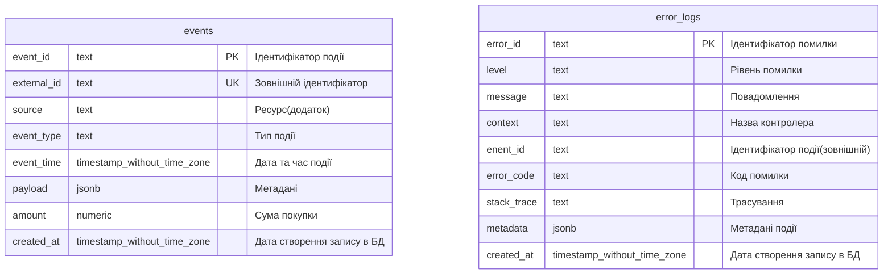

# 🚀 High-Throughput Event Processing System

Цей репозиторій містить реалізацію тестового завдання для позиції Backend Engineer (MarTech).
Система призначена для прийому, валідації та асинхронної обробки великого потоку подій (High Throughput Events) від зовнішніх джерел.

## 🏗 Архітектура та Технологічний стек

Рішення побудоване за принципом Modular Monolith з можливістю горизонтального масштабування.

- Language: TypeScript
- Framework: NestJS (Microservices mode)
- Database: PostgreSQL 15 (Schema: integration, JSONB storage)
- ORM: Prisma
- Message Broker: NATS (Pub/Sub with Queue Groups)
- Infrastructure: Docker & Docker Compose
- Monitoring/Tooling: pgAdmin 4

### Схема потоку даних

1. Ingestion (Gateway): HTTP Endpoint (/webhook) приймає події (одиночні або пачками/batches).
2. Validation: Ручна валідація DTO для кожного елемента масиву, фільтрація некоректних даних.
3. Queueing: Валідні події розбиваються і відправляються в NATS (Fire-and-Forget).
4. Processing (Worker): Воркери вичитують чергу, нормалізують дані (виправлення timestamp, витягування суми покупок) та зберігають у БД.
5. Persistence: Гібридне зберігання: ключові поля (externalId, source) + повний payload у форматі JSONB.

## ✨ Key Features

### 🚀 Scalability

- Підтримка запуску кількох екземплярів додатку
- Використання NATS Queue Groups для балансування навантаження між воркерами.

### 🛡 Resilience

- Docker Healthchecks: Сервіси чекають повної готовності БД перед стартом.
- Automatic Restarts: Політики restart: always/on-failure для відновлення після збоїв.
- Error Handling: Обробка дублікатів  та невалідних форматів дати без падіння воркера.
- Logging: Логування і зберігання помилок, івентів які надходять.

### ⚡ Performance

- Batch Processing: Підтримка прийому масивів подій (batch insert) на рівні HTTP.
- Payload Handling: Налаштовані ліміти до 50MB для HTTP та NATS.
- Non-blocking I/O: Асинхронна відправка в чергу без очікування запису в БД.
- Indexing: Індексована і оптимізована БД.

### 🔍 Validation

- Строга типізація через DTO (class-validator).
- Фільтрація "битих" івентів на вході (Fail Fast).

## 🛠 Setup & Run

Для запуску потрібен лише встановлений Docker Desktop.

1. Запуск (One Command)

Команда підніме всю інфраструктуру, створить базу даних, застосує міграції та запустить додаток.

```bash
docker-compose up --build
```

2. Зупинка та очищення

Якщо потрібно скинути базу даних та почати з нуля:

```bash
docker-compose down -v
```

3. Логи
Якщо потрібно переглнути логи:

```bash
docker-compose logs -f app
```

## 📡 API Endpoints

### 1. Webhook (Ingestion)

Приймає події від генератора.

- URL: `POST` ```http://localhost:3000/webhook```
- Body: `JSON` Object або Array of Objects.
- Response: 202 Accepted

---

### 2. Analytics (Reporting)

Отримання агрегованої статистики.

URL: `GET` ```http://localhost:3000/analytics/stats```

Response Example:

```json
{
  "status": 200,
  "totalEvents": 195,
  "totalAmount": 12500.50,
  "breakdownSource": [
    { 
      "source": "facebook", 
      "eventType": "ad.click", 
      "count": 150,
      "amountSum":"12500.50"
    },
    { 
      "source": "tiktok", 
      "eventType": "purchase", 
      "count": 45,
      "amountSum":null
    }
  ],
  "breakdown":[
    { 
      "source": "facebook", 
      "count": 150,
      "amountSum":"12500.50"
    },
    { 
      "source": "tiktok", 
      "count": 45,
      "amountSum":null
    }
  ]
}
```

---

### 3. Errors List

Отримання переліку помилок із можливістю фільтрації.

URL: `GET` ```http://localhost:3000/analytics/errors```

Query params:

|Назва|Тип|Опис|
|---|---|---|
|level|`String`|Фільтр за рівнем помилки: `error`, `warn`, `info`|
|context|`String`|Фільтр за контекстом (назва контролера/сервісу, наприклад: `AppController`, `EventProcessorController`)|
|limit|`Integer`|Максимальна кількість записів (максимум 100, за замовчуванням 50)|
|page|`Integer`|Сторіка (номер сторіки відображення, за замовченням 1)|

Response Example:

```json
{
  "status": 200,
  "total": 7,
   "stats": [
    {
      "level": "error",
      "context": "EventProcessorController",
      "count": 5
    },
    {
      "level": "warn",
      "context": "AppController",
      "count": 2
    }
  ],
  "errors": [
    {
      "errorId": "550e8400-e29b-41d4-a716-446655440000",
      "level": "error",
      "message": "Error saving event: Connection timeout",
      "context": "EventProcessorController",
      "eventId": "event-123",
      "errorCode": "ETIMEDOUT",
      "stackTrace": "Error: Connection timeout\n    at ...",
      "metadata": {
        "eventType": "purchase",
        "source": "facebook"
      },
      "createdAt": "2024-01-15T10:30:00.000Z"
    },
    {
      "errorId": "660e8400-e29b-41d4-a716-446655440001",
      "level": "warn",
      "message": "Duplicate event skipped: event-456",
      "context": "EventProcessorController",
      "eventId": "event-456",
      "errorCode": "P2002",
      "stackTrace": null,
      "metadata": {
        "eventType": "ad.click",
        "source": "tiktok"
      },
      "createdAt": "2024-01-15T10:25:00.000Z"
    }
  ]
}
```

---

### 4. Top Countries

Отримання топ-країн за кількістю подій (10 записів).

- URL: `GET` ```http://localhost:3000/analytics/top-countries```

Query params:

|Назва|Тип|Опис|
|---|---|---|
|limit|`Integer`|Максимальна кількість записів (максимум 100, за замовчуванням 10)|

Response Example:

```json
{
  "status": 200,
  "stats": [
    { "country": "US", "totalEvents": 1200 },
    { "country": "UA", "totalEvents": 300 }
  ]
}
```

---

### 5. Top Devices

Отримання статистики за типами девайсів (device).

- URL: `GET` ```http://localhost:3000/analytics/top-devices```

Query params:

|Назва|Тип|Опис|
|---|---|---|
|limit|`Integer`|Максимальна кількість записів (максимум 100, за замовчуванням 10)|

Response Example:

```json
{
  "status": 200,
  "stats": [
    { "device": "mobile", "totalEvents": 1500 },
    { "device": "desktop", "totalEvents": 800 }
  ]
}
```

---

### c

Прогонить швидку перевірку сервісу та БД.

- URL: `GET` ```http://localhost:3000/health```

Response Examples:

`200 OK` (healthy):

```json
{
  "status": 200,
  "healthy": true,
  "db": "ok"
}
```

`503 Service Unavailable`:

```json
{
  "status": 503,
  "healthy": false,
  "db": "error",
  "error": "Connection timeout"
}
```

## 🗄 Database & Management

У проект включено `pgAdmin 4` для зручного перегляду даних.

URL: <http://localhost:5050>

Login: <admin@admin.com>

Password: admin

Налаштування підключення в `pgAdmin`:

Host: postgres (ім'я сервісу в Docker мережі)

Username: postgres

Password: postgres

Database: analytics_db

Важливо: Дані знаходяться у схемі integration.
Шлях: Servers > [Your Server] > Databases > analytics_db > Schemas > integration > Tables > events.

## ERD


